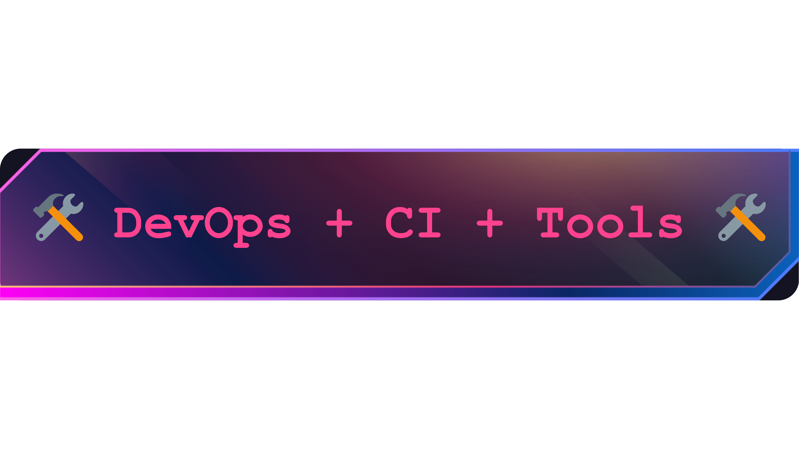

<!-- Title Section -->

  
<h1></h1>

  <!-- Gif -->
  

    
  

  <!-- Brief Summary -->
  <h4 align="center"
  >
    Hey, I'm Lucas. I build stuff with code—mostly React, Node.js, and Python.
    Love tech, just here, chillin' and making things work. Hit me up if you
    vibe. And yeah... Just coding...
  </h4>

<!-- Front-End Section -->

  

  
  
  
  

<!-- Back-End Section -->

  

  
  
  
  
  

<!-- DevOps + CI + Tools Section -->

  

  
  
  
  
  
  
  

<!-- Spotify Section -->

  
  

<!-- Contact Section -->
  

    <h1>Connect Me..(●'◡'●)</h1>
  

  

    
    
    
    
  

<!-- Contributions Section -->

  

  

