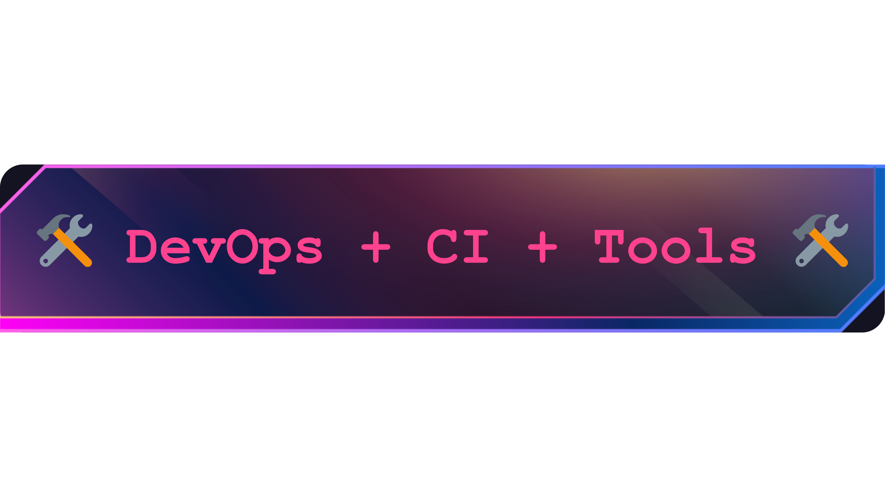

<!-- Title Section -->

    

<!-- Front-End Section -->

    
    
    
    

<!-- Back-End Section -->

    
    
    
    
    

<!-- DevOps + CI + Tools Section -->

  
  
  
  
  
  
  

<!-- Contact Section -->

|  |  |  |  |
| :------------------------------------------------------------------------------------------------------------------: | :------------------------------------------------------------------------------------------: | :----------------------------------------------------------------------------------: | :------------------------------------------------------------------------------------------------------------------------------: |

  

